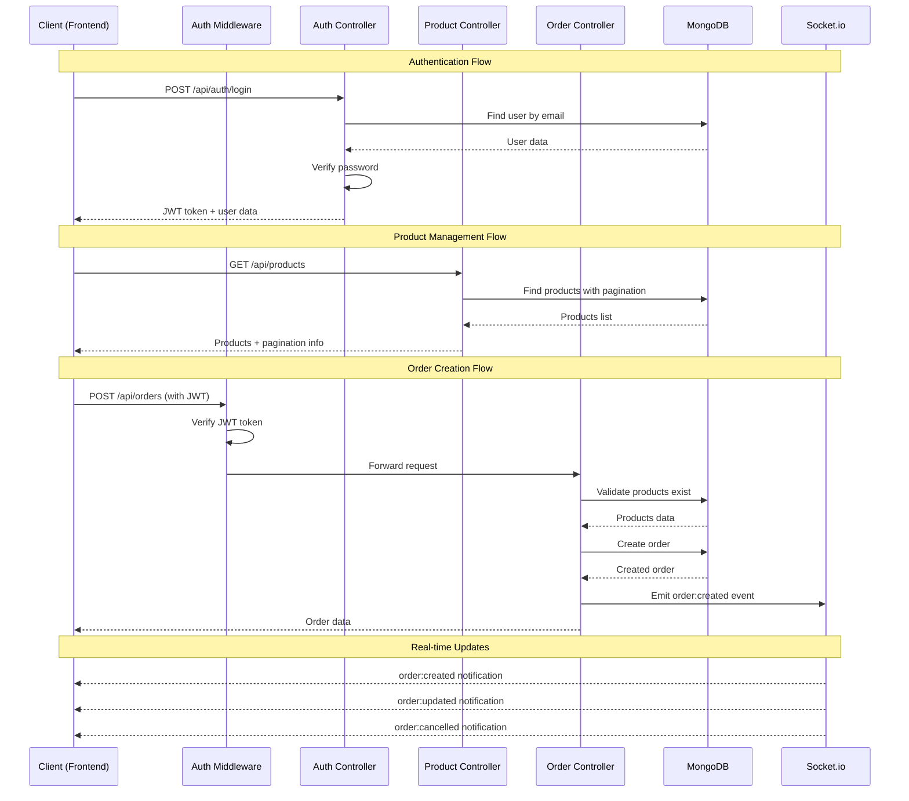

# 5. API Endpoints Flow Diagram - Food App

```mermaid
sequenceDiagram
    participant C as Client (Frontend)
    participant A as Auth Middleware
    participant AC as Auth Controller
    participant PC as Product Controller
    participant OC as Order Controller
    participant DB as MongoDB
    participant S as Socket.io

    Note over C,S: Authentication Flow
    C->>AC: POST /api/auth/login
    AC->>DB: Find user by email
    DB-->>AC: User data
    AC->>AC: Verify password
    AC-->>C: JWT token + user data

    Note over C,S: Product Management Flow
    C->>PC: GET /api/products
    PC->>DB: Find products with pagination
    DB-->>PC: Products list
    PC-->>C: Products + pagination info

    Note over C,S: Order Creation Flow
    C->>A: POST /api/orders (with JWT)
    A->>A: Verify JWT token
    A->>OC: Forward request
    OC->>DB: Validate products exist
    DB-->>OC: Products data
    OC->>DB: Create order
    DB-->>OC: Created order
    OC->>S: Emit order:created event
    OC-->>C: Order data

    Note over C,S: Real-time Updates
    S-->>C: order:created notification
    S-->>C: order:updated notification
    S-->>C: order:cancelled notification
```

