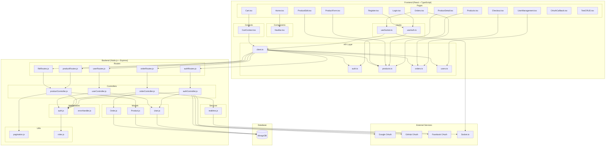

# 3. Component Architecture Diagram - Food App

```mermaid
graph TB
    subgraph "Frontend (React + TypeScript)"
        subgraph "Pages"
            P1[Home.tsx]
            P2[Login.tsx]
            P3[Register.tsx]
            P4[Products.tsx]
            P5[ProductDetail.tsx]
            P6[ProductForm.tsx]
            P7[ProductEdit.tsx]
            P8[Cart.tsx]
            P9[Checkout.tsx]
            P10[Orders.tsx]
            P11[UserManagement.tsx]
            P12[OAuthCallback.tsx]
            P13[TestCRUD.tsx]
        end
        
        subgraph "Components"
            C1[NavBar.tsx]
        end
        
        subgraph "Contexts"
            CT1[CartContext.tsx]
        end
        
        subgraph "Hooks"
            H1[useAuth.ts]
            H2[useSocket.ts]
        end
        
        subgraph "API Layer"
            A1[client.ts]
            A2[auth.ts]
            A3[products.ts]
            A4[orders.ts]
            A5[users.ts]
        end
    end

    subgraph "Backend (Node.js + Express)"
        subgraph "Controllers"
            BC1[authController.js]
            BC2[productController.js]
            BC3[orderController.js]
            BC4[userController.js]
        end
        
        subgraph "Models"
            BM1[User.js]
            BM2[Product.js]
            BM3[Order.js]
        end
        
        subgraph "Routes"
            BR1[authRoutes.js]
            BR2[productRoutes.js]
            BR3[orderRoutes.js]
            BR4[userRoutes.js]
            BR5[fileRoutes.js]
        end
        
        subgraph "Services"
            BS1[realtime.js]
        end
        
        subgraph "Middlewares"
            BMW1[auth.js]
            BMW2[errorHandler.js]
        end
        
        subgraph "Utils"
            BU1[pagination.js]
            BU2[roles.js]
        end
    end

    subgraph "Database"
        DB[(MongoDB)]
    end

    subgraph "External Services"
        EXT1[Google OAuth]
        EXT2[GitHub OAuth]
        EXT3[Facebook OAuth]
        EXT4[Socket.io]
    end

    %% Frontend connections
    P1 --> C1
    P2 --> H1
    P3 --> H1
    P4 --> A3
    P5 --> A3
    P6 --> A3
    P7 --> A3
    P8 --> CT1
    P9 --> A4
    P10 --> A4
    P10 --> H2
    P11 --> A5
    
    H1 --> A2
    H2 --> A1
    CT1 --> A1
    
    A1 --> A2
    A1 --> A3
    A1 --> A4
    A1 --> A5

    %% Backend connections
    BR1 --> BC1
    BR2 --> BC2
    BR3 --> BC3
    BR4 --> BC4
    BR5 --> BC2
    
    BC1 --> BM1
    BC2 --> BM2
    BC3 --> BM3
    BC4 --> BM1
    
    BC1 --> BMW1
    BC2 --> BMW1
    BC3 --> BMW1
    BC4 --> BMW1
    
    BC3 --> BS1
    
    BMW1 --> BU2
    BC2 --> BU1

    %% Database connections
    BM1 --> DB
    BM2 --> DB
    BM3 --> DB

    %% External connections
    BC1 --> EXT1
    BC1 --> EXT2
    BC1 --> EXT3
    BS1 --> EXT4
    H2 --> EXT4

    %% Frontend-Backend connections
    A1 --> BR1
    A1 --> BR2
    A1 --> BR3
    A1 --> BR4
    A1 --> BR5
```

