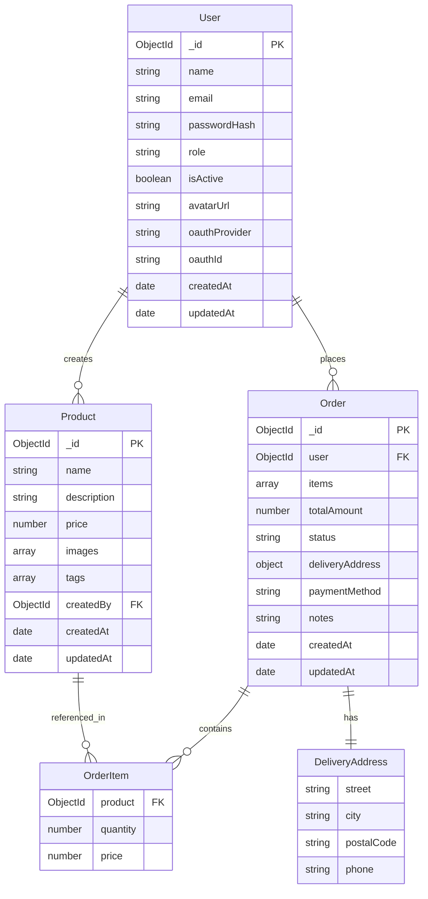

# 4. Database Schema Diagram - Food App

```mermaid
erDiagram
    User {
        ObjectId _id PK
        string name
        string email
        string passwordHash
        string role
        boolean isActive
        string avatarUrl
        string oauthProvider
        string oauthId
        date createdAt
        date updatedAt
    }

    Product {
        ObjectId _id PK
        string name
        string description
        number price
        array images
        array tags
        ObjectId createdBy FK
        date createdAt
        date updatedAt
    }

    Order {
        ObjectId _id PK
        ObjectId user FK
        array items
        number totalAmount
        string status
        object deliveryAddress
        string paymentMethod
        string notes
        date createdAt
        date updatedAt
    }

    OrderItem {
        ObjectId product FK
        number quantity
        number price
    }

    DeliveryAddress {
        string street
        string city
        string postalCode
        string phone
    }

    User ||--o{ Product : "creates"
    User ||--o{ Order : "places"
    Product ||--o{ OrderItem : "referenced_in"
    Order ||--o{ OrderItem : "contains"
    Order ||--|| DeliveryAddress : "has"
```

