# Food App - Ứng dụng đặt món ăn

## Tổng quan

Food App là một ứng dụng web full-stack cho phép người dùng đặt món ăn trực tuyến. Ứng dụng được xây dựng với:
- **Frontend**: React + TypeScript + Material-UI
- **Backend**: Node.js + Express + MongoDB + Socket.io
- **Authentication**: JWT + OAuth (Google, GitHub, Facebook)

## Kiến trúc hệ thống

### 1. Sơ đồ UML - Class Diagram

```mermaid
classDiagram
    class User {
        +String name
        +String email
        +String passwordHash
        +String role
        +Boolean isActive
        +String avatarUrl
        +String oauthProvider
        +String oauthId
        +Date createdAt
        +Date updatedAt
        +comparePassword(password) Boolean
    }

    class Product {
        +String name
        +String description
        +Number price
        +String[] images
        +String[] tags
        +ObjectId createdBy
        +Date createdAt
        +Date updatedAt
    }

    class Order {
        +ObjectId user
        +OrderItem[] items
        +Number totalAmount
        +String status
        +DeliveryAddress deliveryAddress
        +String paymentMethod
        +String notes
        +Date createdAt
        +Date updatedAt
        +calculateTotal() Number
    }

    class OrderItem {
        +ObjectId product
        +Number quantity
        +Number price
    }

    class DeliveryAddress {
        +String street
        +String city
        +String postalCode
        +String phone
    }

    class CartContext {
        +CartItem[] items
        +Number totalItems
        +Number totalAmount
        +addItem(item) void
        +removeItem(productId) void
        +updateQuantity(productId, quantity) void
        +clearCart() void
    }

    class CartItem {
        +Product product
        +Number quantity
    }

    class AuthController {
        +register(req, res, next) void
        +login(req, res, next) void
        +me(req, res, next) void
        +oauthSuccess(req, res) void
    }

    class ProductController {
        +createProduct(req, res, next) void
        +getProducts(req, res, next) void
        +getProductById(req, res, next) void
        +updateProduct(req, res, next) void
        +deleteProduct(req, res, next) void
    }

    class OrderController {
        +createOrder(req, res, next) void
        +getUserOrders(req, res, next) void
        +getOrderById(req, res, next) void
        +updateOrderStatus(req, res, next) void
        +cancelOrder(req, res, next) void
        +getAllOrders(req, res, next) void
    }

    class RealtimeService {
        +initializeRealtime(server) void
        +emitToUser(userId, event, data) void
    }

    User ||--o{ Order : "places"
    User ||--o{ Product : "creates"
    Order ||--o{ OrderItem : "contains"
    OrderItem }o--|| Product : "references"
    Order ||--|| DeliveryAddress : "has"
    CartContext ||--o{ CartItem : "manages"
    CartItem }o--|| Product : "references"
    AuthController --> User : "manages"
    ProductController --> Product : "manages"
    OrderController --> Order : "manages"
    OrderController --> RealtimeService : "uses"
```

### 2. Use Case Diagram

```mermaid
graph TD
    subgraph "Food App System"
        subgraph "User Management"
            UC1[Đăng ký tài khoản]
            UC2[Đăng nhập]
            UC3[Đăng xuất]
            UC4[OAuth Login<br/>Google/GitHub/Facebook]
            UC5[Xem thông tin cá nhân]
        end

        subgraph "Product Management"
            UC6[Xem danh sách sản phẩm]
            UC7[Xem chi tiết sản phẩm]
            UC8[Tìm kiếm sản phẩm]
            UC9[Lọc sản phẩm theo tag]
            UC10[Tạo sản phẩm mới]
            UC11[Chỉnh sửa sản phẩm]
            UC12[Xóa sản phẩm]
        end

        subgraph "Shopping Cart"
            UC13[Thêm sản phẩm vào giỏ hàng]
            UC14[Xóa sản phẩm khỏi giỏ hàng]
            UC15[Cập nhật số lượng]
            UC16[Xem giỏ hàng]
            UC17[Xóa toàn bộ giỏ hàng]
        end

        subgraph "Order Management"
            UC18[Tạo đơn hàng]
            UC19[Xem lịch sử đơn hàng]
            UC20[Xem chi tiết đơn hàng]
            UC21[Hủy đơn hàng]
            UC22[Cập nhật trạng thái đơn hàng]
        end

        subgraph "User Management Admin"
            UC23[Xem danh sách người dùng]
            UC24[Quản lý vai trò người dùng]
            UC25[Xem tất cả đơn hàng]
        end

        subgraph "Real-time Features"
            UC26[Thông báo đơn hàng mới]
            UC27[Thông báo cập nhật trạng thái]
            UC28[Thông báo hủy đơn hàng]
        end
    end

    subgraph "Actors"
        Customer[Khách hàng]
        Admin[Quản trị viên]
        OAuthProvider[OAuth Provider<br/>Google/GitHub/Facebook]
    end

    %% Customer Use Cases
    Customer --> UC1
    Customer --> UC2
    Customer --> UC3
    Customer --> UC4
    Customer --> UC5
    Customer --> UC6
    Customer --> UC7
    Customer --> UC8
    Customer --> UC9
    Customer --> UC13
    Customer --> UC14
    Customer --> UC15
    Customer --> UC16
    Customer --> UC17
    Customer --> UC18
    Customer --> UC19
    Customer --> UC20
    Customer --> UC21
    Customer --> UC26
    Customer --> UC27
    Customer --> UC28

    %% Admin Use Cases
    Admin --> UC2
    Admin --> UC3
    Admin --> UC5
    Admin --> UC6
    Admin --> UC7
    Admin --> UC10
    Admin --> UC11
    Admin --> UC12
    Admin --> UC22
    Admin --> UC23
    Admin --> UC24
    Admin --> UC25
    Admin --> UC26
    Admin --> UC27
    Admin --> UC28

    %% OAuth Provider
    OAuthProvider --> UC4

    %% Include relationships
    UC18 -.->|includes| UC16
    UC18 -.->|includes| UC5
    UC21 -.->|includes| UC19
    UC22 -.->|includes| UC25
    UC13 -.->|extends| UC7
    UC14 -.->|extends| UC16
    UC15 -.->|extends| UC16
```



## Tính năng chính

### 1. Xác thực người dùng
- Đăng ký/Đăng nhập với email và mật khẩu
- OAuth đăng nhập (Google, GitHub, Facebook)
- Quản lý phiên đăng nhập với JWT
- Phân quyền người dùng (User/Admin)

### 2. Quản lý sản phẩm
- Hiển thị danh sách sản phẩm với phân trang
- Tìm kiếm và lọc sản phẩm
- Tạo, chỉnh sửa, xóa sản phẩm (Admin)
- Upload hình ảnh sản phẩm

### 3. Giỏ hàng
- Thêm/xóa sản phẩm vào giỏ hàng
- Cập nhật số lượng sản phẩm
- Lưu giỏ hàng theo người dùng
- Tính toán tổng tiền tự động

### 4. Đặt hàng
- Tạo đơn hàng từ giỏ hàng
- Quản lý địa chỉ giao hàng
- Lựa chọn phương thức thanh toán
- Theo dõi trạng thái đơn hàng

### 5. Real-time Updates
- Thông báo trạng thái đơn hàng
- Cập nhật real-time với Socket.io
- Thông báo đơn hàng mới và hủy đơn

### 6. Quản trị
- Quản lý người dùng (Admin)
- Xem và cập nhật tất cả đơn hàng
- Quản lý vai trò người dùng

## Công nghệ sử dụng

### Frontend
- **React 19** - UI Framework
- **TypeScript** - Type Safety
- **Material-UI** - Component Library
- **React Router** - Routing
- **Axios** - HTTP Client
- **Socket.io Client** - Real-time Communication

### Backend
- **Node.js** - Runtime Environment
- **Express.js** - Web Framework
- **MongoDB** - Database
- **Mongoose** - ODM
- **JWT** - Authentication
- **Passport.js** - OAuth Authentication
- **Socket.io** - Real-time Communication
- **Multer** - File Upload
- **Bcryptjs** - Password Hashing

## Cài đặt và chạy

### Backend
```bash
cd backend
npm install
npm run dev
```

### Frontend
```bash
cd frontend
npm install
npm run dev
```

## Cấu trúc dự án

```
Food App/
├── backend/
│   ├── src/
│   │   ├── controllers/     # Logic xử lý request
│   │   ├── models/          # MongoDB schemas
│   │   ├── routes/          # API routes
│   │   ├── middlewares/     # Custom middlewares
│   │   ├── services/        # Business logic services
│   │   └── utils/           # Utility functions
│   └── uploads/             # Uploaded files
└── frontend/
    ├── src/
    │   ├── components/      # Reusable components
    │   ├── pages/           # Page components
    │   ├── contexts/        # React contexts
    │   ├── hooks/           # Custom hooks
    │   ├── api/             # API client functions
    │   └── utils/           # Utility functions
    └── public/              # Static assets
```

## API Endpoints

### Authentication
- `POST /api/auth/register` - Đăng ký
- `POST /api/auth/login` - Đăng nhập
- `GET /api/auth/me` - Lấy thông tin user
- `GET /api/auth/google` - Google OAuth
- `GET /api/auth/github` - GitHub OAuth
- `GET /api/auth/facebook` - Facebook OAuth

### Products
- `GET /api/products` - Lấy danh sách sản phẩm
- `POST /api/products` - Tạo sản phẩm mới
- `GET /api/products/:id` - Lấy chi tiết sản phẩm
- `PUT /api/products/:id` - Cập nhật sản phẩm
- `DELETE /api/products/:id` - Xóa sản phẩm

### Orders
- `POST /api/orders` - Tạo đơn hàng
- `GET /api/orders` - Lấy đơn hàng của user
- `GET /api/orders/:id` - Lấy chi tiết đơn hàng
- `PUT /api/orders/:id/status` - Cập nhật trạng thái
- `DELETE /api/orders/:id` - Hủy đơn hàng

### Users
- `GET /api/users` - Lấy danh sách users (Admin)
- `PUT /api/users/:id` - Cập nhật user
- `DELETE /api/users/:id` - Xóa user
