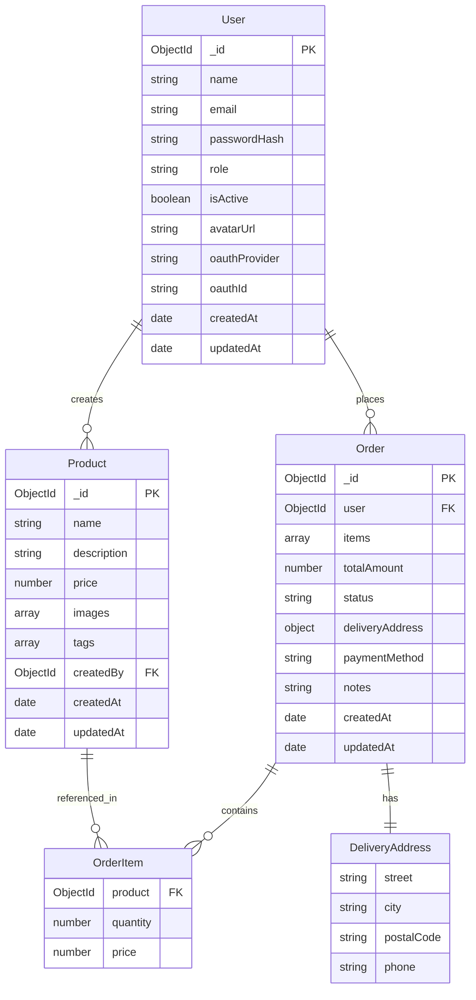
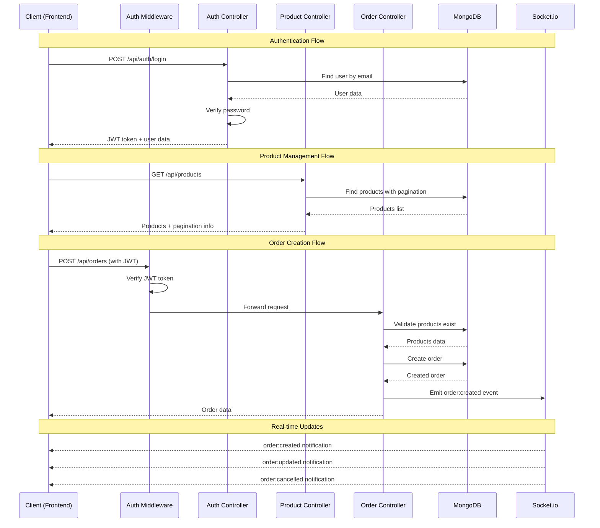
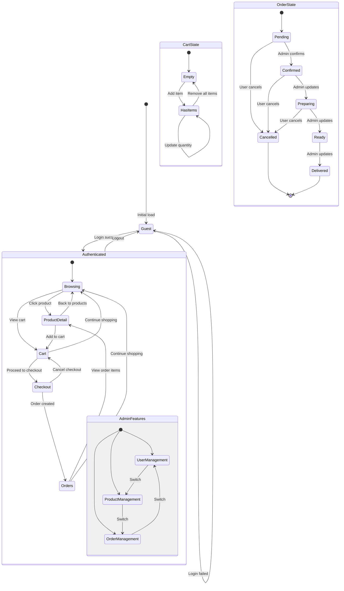

# UML và Use Case Diagrams - Food App

## 1. Class Diagram (Dựa trên code thực tế)

```mermaid
classDiagram
    %% Backend Models (MongoDB/Mongoose)
    class User {
        +String name
        +String email
        +String passwordHash
        +String role
        +Boolean isActive
        +String avatarUrl
        +String oauthProvider
        +String oauthId
        +Date createdAt
        +Date updatedAt
        +comparePassword(password) Boolean
    }

    class Product {
        +String name
        +String description
        +Number price
        +String[] images
        +String[] tags
        +ObjectId createdBy
        +Date createdAt
        +Date updatedAt
    }

    class Order {
        +ObjectId user
        +OrderItem[] items
        +Number totalAmount
        +String status
        +DeliveryAddress deliveryAddress
        +String paymentMethod
        +String notes
        +Date createdAt
        +Date updatedAt
        +calculateTotal() Number
    }

    class OrderItem {
        +ObjectId product
        +Number quantity
        +Number price
    }

    class DeliveryAddress {
        +String street
        +String city
        +String postalCode
        +String phone
    }

    %% Frontend Types & Contexts
    class CartContext {
        +CartItem[] items
        +Number totalItems
        +Number totalAmount
        +addItem(item) void
        +removeItem(productId) void
        +updateQuantity(productId, quantity) void
        +clearCart() void
    }

    class CartItem {
        +Product product
        +Number quantity
    }

    class AdminOrder {
        +ObjectId user
        +OrderItem[] items
        +Number totalAmount
        +String status
        +DeliveryAddress deliveryAddress
        +String paymentMethod
        +String notes
        +Date createdAt
        +Date updatedAt
        +User userInfo
    }

    %% Backend Controllers
    class AuthController {
        +register(req, res, next) void
        +login(req, res, next) void
        +me(req, res, next) void
        +oauthSuccess(req, res) void
        +signToken(user) String
    }

    class ProductController {
        +createProduct(req, res, next) void
        +getProducts(req, res, next) void
        +getProductById(req, res, next) void
        +updateProduct(req, res, next) void
        +deleteProduct(req, res, next) void
    }

    class OrderController {
        +createOrder(req, res, next) void
        +getUserOrders(req, res, next) void
        +getOrderById(req, res, next) void
        +updateOrderStatus(req, res, next) void
        +cancelOrder(req, res, next) void
        +getAllOrders(req, res, next) void
    }

    class UserController {
        +getUsers(req, res, next) void
        +updateUser(req, res, next) void
        +deleteUser(req, res, next) void
    }

    %% Services
    class RealtimeService {
        +initializeRealtime(server) void
        +emitToUser(userId, event, data) void
    }

    class FileService {
        +uploadFile(req, res, next) void
        +getFile(req, res, next) void
    }

    %% Frontend Hooks & Contexts
    class useAuth {
        +token String
        +user Object
        +isLoading Boolean
        +setToken(token) void
        +setUser(user) void
        +refreshUser() void
        +updateToken(token) void
    }

    class useSocket {
        +socket Socket
        +connect() void
        +disconnect() void
    }

    %% Relationships
    User ||--o{ Order : "places"
    User ||--o{ Product : "creates"
    Order ||--o{ OrderItem : "contains"
    OrderItem }o--|| Product : "references"
    Order ||--|| DeliveryAddress : "has"
    CartContext ||--o{ CartItem : "manages"
    CartItem }o--|| Product : "references"
    AdminOrder --|> Order : "extends"
    
    %% Controller relationships
    AuthController --> User : "manages"
    ProductController --> Product : "manages"
    OrderController --> Order : "manages"
    OrderController --> RealtimeService : "uses"
    UserController --> User : "manages"
    FileService --> Product : "handles uploads"
    
    %% Frontend relationships
    useAuth --> User : "manages state"
    useSocket --> RealtimeService : "connects to"
    CartContext --> CartItem : "manages"
```

## 2. Use Case Diagram (Dựa trên code thực tế)

```mermaid
graph TD
    subgraph "Food App System"
        subgraph "Authentication & User Management"
            UC1[Đăng ký tài khoản]
            UC2[Đăng nhập bằng email/password]
            UC3[Đăng xuất]
            UC4[OAuth Login - Google]
            UC5[OAuth Login - GitHub]
            UC6[OAuth Login - Facebook]
            UC7[Xem thông tin cá nhân]
            UC8[Quản lý người dùng - Admin]
            UC9[Cập nhật vai trò người dùng - Admin]
        end

        subgraph "Product Management"
            UC10[Xem danh sách sản phẩm]
            UC11[Xem chi tiết sản phẩm]
            UC12[Tìm kiếm sản phẩm]
            UC13[Lọc sản phẩm theo tag]
            UC14[Phân trang sản phẩm]
            UC15[Tạo sản phẩm mới - Admin]
            UC16[Chỉnh sửa sản phẩm - Admin]
            UC17[Xóa sản phẩm - Admin]
            UC18[Upload hình ảnh sản phẩm]
        end

        subgraph "Shopping Cart Management"
            UC19[Thêm sản phẩm vào giỏ hàng]
            UC20[Xóa sản phẩm khỏi giỏ hàng]
            UC21[Cập nhật số lượng sản phẩm]
            UC22[Xem giỏ hàng]
            UC23[Xóa toàn bộ giỏ hàng]
            UC24[Lưu giỏ hàng theo user]
            UC25[Tính toán tổng tiền tự động]
        end

        subgraph "Order Management"
            UC26[Tạo đơn hàng từ giỏ hàng]
            UC27[Xem lịch sử đơn hàng cá nhân]
            UC28[Xem chi tiết đơn hàng]
            UC29[Hủy đơn hàng]
            UC30[Xem tất cả đơn hàng - Admin]
            UC31[Cập nhật trạng thái đơn hàng - Admin]
            UC32[Quản lý địa chỉ giao hàng]
            UC33[Lựa chọn phương thức thanh toán]
            UC34[Thêm ghi chú đặc biệt]
        end

        subgraph "Real-time Features"
            UC35[Thông báo đơn hàng mới]
            UC36[Thông báo cập nhật trạng thái]
            UC37[Thông báo hủy đơn hàng]
            UC38[Kết nối WebSocket]
        end

        subgraph "File Management"
            UC39[Upload file hình ảnh]
            UC40[Lấy file hình ảnh]
            UC41[Quản lý thư mục uploads]
        end

        subgraph "API & System"
            UC42[JWT Authentication]
            UC43[API Rate Limiting]
            UC44[Error Handling]
            UC45[Validation Input]
            UC46[Database Connection]
        end
    end

    subgraph "Actors"
        Customer[Khách hàng]
        Admin[Quản trị viên]
        GoogleOAuth[Google OAuth]
        GitHubOAuth[GitHub OAuth]
        FacebookOAuth[Facebook OAuth]
        System[System Services]
    end

    %% Customer Use Cases
    Customer --> UC1
    Customer --> UC2
    Customer --> UC3
    Customer --> UC4
    Customer --> UC5
    Customer --> UC6
    Customer --> UC7
    Customer --> UC10
    Customer --> UC11
    Customer --> UC12
    Customer --> UC13
    Customer --> UC14
    Customer --> UC19
    Customer --> UC20
    Customer --> UC21
    Customer --> UC22
    Customer --> UC23
    Customer --> UC24
    Customer --> UC25
    Customer --> UC26
    Customer --> UC27
    Customer --> UC28
    Customer --> UC29
    Customer --> UC32
    Customer --> UC33
    Customer --> UC34
    Customer --> UC35
    Customer --> UC36
    Customer --> UC37
    Customer --> UC38

    %% Admin Use Cases
    Admin --> UC2
    Admin --> UC3
    Admin --> UC7
    Admin --> UC8
    Admin --> UC9
    Admin --> UC10
    Admin --> UC11
    Admin --> UC12
    Admin --> UC13
    Admin --> UC14
    Admin --> UC15
    Admin --> UC16
    Admin --> UC17
    Admin --> UC18
    Admin --> UC26
    Admin --> UC28
    Admin --> UC30
    Admin --> UC31
    Admin --> UC35
    Admin --> UC36
    Admin --> UC37
    Admin --> UC38
    Admin --> UC39
    Admin --> UC40
    Admin --> UC41

    %% OAuth Providers
    GoogleOAuth --> UC4
    GitHubOAuth --> UC5
    FacebookOAuth --> UC6

    %% System Use Cases
    System --> UC42
    System --> UC43
    System --> UC44
    System --> UC45
    System --> UC46

    %% Include relationships
    UC26 -.->|includes| UC22
    UC26 -.->|includes| UC7
    UC26 -.->|includes| UC32
    UC29 -.->|includes| UC27
    UC31 -.->|includes| UC30
    UC19 -.->|extends| UC11
    UC20 -.->|extends| UC22
    UC21 -.->|extends| UC22
    UC35 -.->|extends| UC26
    UC36 -.->|extends| UC31
    UC37 -.->|extends| UC29
    UC18 -.->|includes| UC15
    UC18 -.->|includes| UC16
    UC39 -.->|includes| UC41
    UC40 -.->|includes| UC41

    %% Extend relationships
    UC4 -.->|extends| UC2
    UC5 -.->|extends| UC2
    UC6 -.->|extends| UC2
    UC8 -.->|extends| UC7
    UC9 -.->|extends| UC8
```



## 3. Component Architecture Diagram

```mermaid
graph TB
    subgraph "Frontend (React + TypeScript)"
        subgraph "Pages"
            P1[Home.tsx]
            P2[Login.tsx]
            P3[Register.tsx]
            P4[Products.tsx]
            P5[ProductDetail.tsx]
            P6[ProductForm.tsx]
            P7[ProductEdit.tsx]
            P8[Cart.tsx]
            P9[Checkout.tsx]
            P10[Orders.tsx]
            P11[UserManagement.tsx]
            P12[OAuthCallback.tsx]
        end
        
        subgraph "Components"
            C1[NavBar.tsx]
        end
        
        subgraph "Contexts"
            CT1[CartContext.tsx]
        end
        
        subgraph "Hooks"
            H1[useAuth.ts]
            H2[useSocket.ts]
        end
        
        subgraph "API Layer"
            A1[client.ts]
            A2[auth.ts]
            A3[products.ts]
            A4[orders.ts]
            A5[users.ts]
        end
    end

    subgraph "Backend (Node.js + Express)"
        subgraph "Controllers"
            BC1[authController.js]
            BC2[productController.js]
            BC3[orderController.js]
            BC4[userController.js]
        end
        
        subgraph "Models"
            BM1[User.js]
            BM2[Product.js]
            BM3[Order.js]
        end
        
        subgraph "Routes"
            BR1[authRoutes.js]
            BR2[productRoutes.js]
            BR3[orderRoutes.js]
            BR4[userRoutes.js]
            BR5[fileRoutes.js]
        end
        
        subgraph "Services"
            BS1[realtime.js]
        end
        
        subgraph "Middlewares"
            BMW1[auth.js]
            BMW2[errorHandler.js]
        end
        
        subgraph "Utils"
            BU1[pagination.js]
            BU2[roles.js]
        end
    end

    subgraph "Database"
        DB[(MongoDB)]
    end

    subgraph "External Services"
        EXT1[Google OAuth]
        EXT2[GitHub OAuth]
        EXT3[Facebook OAuth]
        EXT4[Socket.io]
    end

    %% Frontend connections
    P1 --> C1
    P2 --> H1
    P3 --> H1
    P4 --> A3
    P5 --> A3
    P6 --> A3
    P7 --> A3
    P8 --> CT1
    P9 --> A4
    P10 --> A4
    P10 --> H2
    P11 --> A5
    
    H1 --> A2
    H2 --> A1
    CT1 --> A1
    
    A1 --> A2
    A1 --> A3
    A1 --> A4
    A1 --> A5

    %% Backend connections
    BR1 --> BC1
    BR2 --> BC2
    BR3 --> BC3
    BR4 --> BC4
    BR5 --> BC2
    
    BC1 --> BM1
    BC2 --> BM2
    BC3 --> BM3
    BC4 --> BM1
    
    BC1 --> BMW1
    BC2 --> BMW1
    BC3 --> BMW1
    BC4 --> BMW1
    
    BC3 --> BS1
    
    BMW1 --> BU2
    BC2 --> BU1

    %% Database connections
    BM1 --> DB
    BM2 --> DB
    BM3 --> DB

    %% External connections
    BC1 --> EXT1
    BC1 --> EXT2
    BC1 --> EXT3
    BS1 --> EXT4
    H2 --> EXT4

    %% Frontend-Backend connections
    A1 --> BR1
    A1 --> BR2
    A1 --> BR3
    A1 --> BR4
    A1 --> BR5
```



## 4. Database Schema Diagram



## 5. API Endpoints Flow Diagram



## 6. State Management Flow



## Tóm tắt kiến trúc

### **Frontend Architecture:**
- **React 19 + TypeScript** với Material-UI
- **Context API** cho state management (CartContext)
- **Custom Hooks** (useAuth, useSocket)
- **API Layer** với Axios client
- **Real-time** với Socket.io client

### **Backend Architecture:**
- **Express.js** với middleware pattern
- **MongoDB + Mongoose** cho data persistence
- **JWT + OAuth** cho authentication
- **Socket.io** cho real-time communication
- **File upload** với Multer

### **Key Features:**
- ✅ **Multi-role authentication** (User/Admin)
- ✅ **OAuth integration** (Google, GitHub, Facebook)
- ✅ **Real-time order updates**
- ✅ **File upload** cho product images
- ✅ **Shopping cart** với localStorage persistence
- ✅ **Admin panel** cho quản lý
- ✅ **Responsive design** với Material-UI
