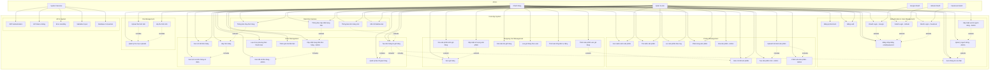

# 2. Use Case Diagram - Food App

```mermaid
graph TD
    subgraph "Food App System"
        subgraph "Authentication & User Management"
            UC1[Đăng ký tài khoản]
            UC2[Đăng nhập bằng email/password]
            UC3[Đăng xuất]
            UC4[OAuth Login - Google]
            UC5[OAuth Login - GitHub]
            UC6[OAuth Login - Facebook]
            UC7[Xem thông tin cá nhân]
            UC8[Quản lý người dùng - Admin]
            UC9[Cập nhật vai trò người dùng - Admin]
        end

        subgraph "Product Management"
            UC10[Xem danh sách sản phẩm]
            UC11[Xem chi tiết sản phẩm]
            UC12[Tìm kiếm sản phẩm]
            UC13[Lọc sản phẩm theo tag]
            UC14[Phân trang sản phẩm]
            UC15[Tạo sản phẩm mới - Admin]
            UC16[Chỉnh sửa sản phẩm - Admin]
            UC17[Xóa sản phẩm - Admin]
            UC18[Upload hình ảnh sản phẩm]
        end

        subgraph "Shopping Cart Management"
            UC19[Thêm sản phẩm vào giỏ hàng]
            UC20[Xóa sản phẩm khỏi giỏ hàng]
            UC21[Cập nhật số lượng sản phẩm]
            UC22[Xem giỏ hàng]
            UC23[Xóa toàn bộ giỏ hàng]
            UC24[Lưu giỏ hàng theo user]
            UC25[Tính toán tổng tiền tự động]
        end

        subgraph "Order Management"
            UC26[Tạo đơn hàng từ giỏ hàng]
            UC27[Xem lịch sử đơn hàng cá nhân]
            UC28[Xem chi tiết đơn hàng]
            UC29[Hủy đơn hàng]
            UC30[Xem tất cả đơn hàng - Admin]
            UC31[Cập nhật trạng thái đơn hàng - Admin]
            UC32[Quản lý địa chỉ giao hàng]
            UC33[Lựa chọn phương thức thanh toán]
            UC34[Thêm ghi chú đặc biệt]
        end

        subgraph "Real-time Features"
            UC35[Thông báo đơn hàng mới]
            UC36[Thông báo cập nhật trạng thái]
            UC37[Thông báo hủy đơn hàng]
            UC38[Kết nối WebSocket]
        end

        subgraph "File Management"
            UC39[Upload file hình ảnh]
            UC40[Lấy file hình ảnh]
            UC41[Quản lý thư mục uploads]
        end

        subgraph "API & System"
            UC42[JWT Authentication]
            UC43[API Rate Limiting]
            UC44[Error Handling]
            UC45[Validation Input]
            UC46[Database Connection]
        end
    end

    subgraph "Actors"
        Customer[Khách hàng]
        Admin[Quản trị viên]
        GoogleOAuth[Google OAuth]
        GitHubOAuth[GitHub OAuth]
        FacebookOAuth[Facebook OAuth]
        System[System Services]
    end

    %% Customer Use Cases
    Customer --> UC1
    Customer --> UC2
    Customer --> UC3
    Customer --> UC4
    Customer --> UC5
    Customer --> UC6
    Customer --> UC7
    Customer --> UC10
    Customer --> UC11
    Customer --> UC12
    Customer --> UC13
    Customer --> UC14
    Customer --> UC19
    Customer --> UC20
    Customer --> UC21
    Customer --> UC22
    Customer --> UC23
    Customer --> UC24
    Customer --> UC25
    Customer --> UC26
    Customer --> UC27
    Customer --> UC28
    Customer --> UC29
    Customer --> UC32
    Customer --> UC33
    Customer --> UC34
    Customer --> UC35
    Customer --> UC36
    Customer --> UC37
    Customer --> UC38

    %% Admin Use Cases
    Admin --> UC2
    Admin --> UC3
    Admin --> UC7
    Admin --> UC8
    Admin --> UC9
    Admin --> UC10
    Admin --> UC11
    Admin --> UC12
    Admin --> UC13
    Admin --> UC14
    Admin --> UC15
    Admin --> UC16
    Admin --> UC17
    Admin --> UC18
    Admin --> UC26
    Admin --> UC28
    Admin --> UC30
    Admin --> UC31
    Admin --> UC35
    Admin --> UC36
    Admin --> UC37
    Admin --> UC38
    Admin --> UC39
    Admin --> UC40
    Admin --> UC41

    %% OAuth Providers
    GoogleOAuth --> UC4
    GitHubOAuth --> UC5
    FacebookOAuth --> UC6

    %% System Use Cases
    System --> UC42
    System --> UC43
    System --> UC44
    System --> UC45
    System --> UC46

    %% Include relationships
    UC26 -.->|includes| UC22
    UC26 -.->|includes| UC7
    UC26 -.->|includes| UC32
    UC29 -.->|includes| UC27
    UC31 -.->|includes| UC30
    UC19 -.->|extends| UC11
    UC20 -.->|extends| UC22
    UC21 -.->|extends| UC22
    UC35 -.->|extends| UC26
    UC36 -.->|extends| UC31
    UC37 -.->|extends| UC29
    UC18 -.->|includes| UC15
    UC18 -.->|includes| UC16
    UC39 -.->|includes| UC41
    UC40 -.->|includes| UC41

    %% Extend relationships
    UC4 -.->|extends| UC2
    UC5 -.->|extends| UC2
    UC6 -.->|extends| UC2
    UC8 -.->|extends| UC7
    UC9 -.->|extends| UC8
```
